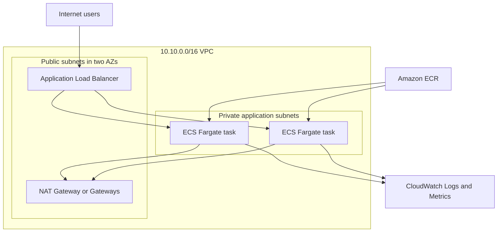

# Architecture Overview

Internet traffic enters an internet-facing Application Load Balancer in two public subnets. The ALB forwards requests to an IP target group containing ECS Fargate tasks in private subnets across two Availability Zones. Tasks pull immutable images from Amazon ECR and publish application logs to CloudWatch. NAT gateways provide controlled outbound access. ECS Service Auto Scaling targets CPU and memory utilization, while CloudWatch alarms publish to an SNS topic. Terraform creates every resource and supports isolated development and production state.

