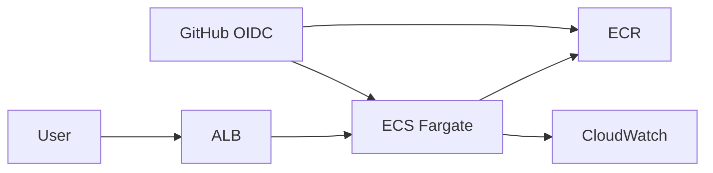

# Terraform Enterprise Deployment

Deploys a containerized API to AWS ECS Fargate across two Availability Zones with an ALB, private application subnets, ECR, autoscaling, CloudWatch, SNS alerts, and a separate encrypted remote-state bootstrap.



## Run
```bash
cp terraform.tfvars.example terraform.tfvars
terraform init && terraform validate && terraform plan
terraform apply
```
Build the included app, push it to the `ecr_repository_url`, then reapply with the immutable image URI. Verify `service_url/healthz`. Finish with `terraform destroy`.

See `docs/SCREENSHOTS.md` and `docs/INTERVIEW-STORY.md`.
