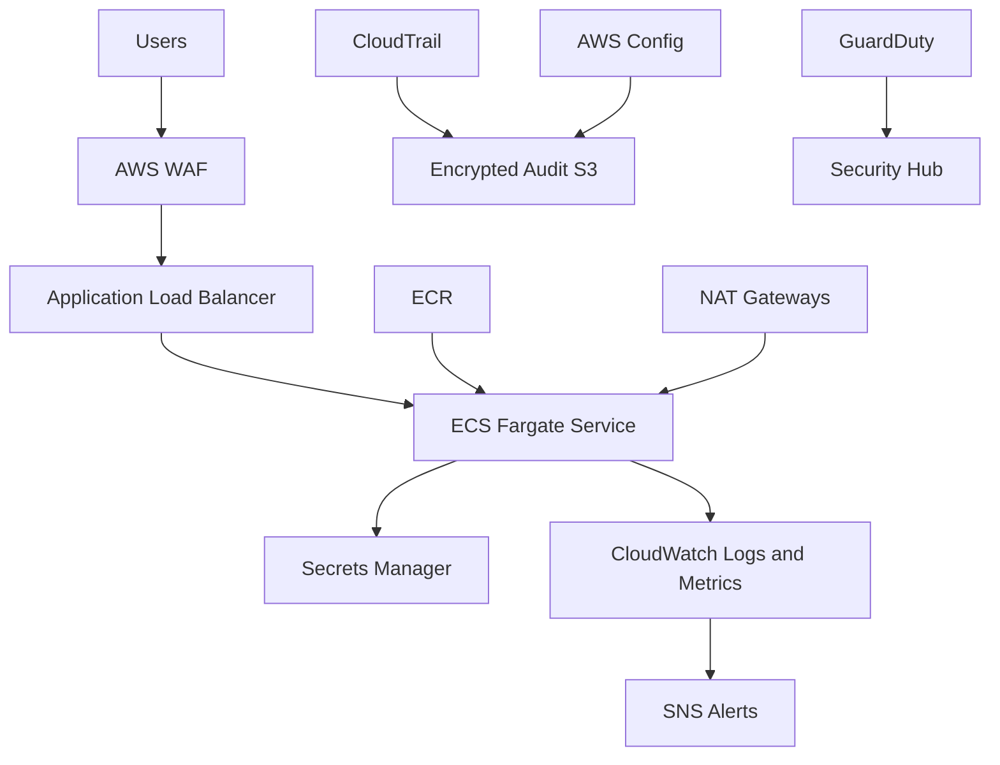

# Architecture

The reference stack uses two availability zones, isolated workload subnets, encrypted storage, least-privilege roles, centralized audit logs, alarms, autoscaling, and remote Terraform state locking.
