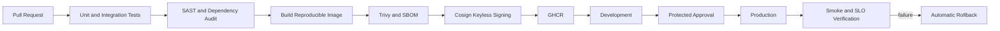

# Delivery Architecture

```mermaid
flowchart LR
  DEV[Pull Request] --> TEST[Unit and Integration Tests]
  TEST --> SAST[SAST and Dependency Audit]
  SAST --> IMG[Build Reproducible Image]
  IMG --> SCAN[Trivy and SBOM]
  SCAN --> SIGN[Cosign Keyless Signing]
  SIGN --> REG[GHCR]
  REG --> DEVENV[Development]
  DEVENV --> APPROVE[Protected Approval]
  APPROVE --> PROD[Production]
  PROD --> VERIFY[Smoke and SLO Verification]
  VERIFY -->|failure| ROLLBACK[Automatic Rollback]
```
