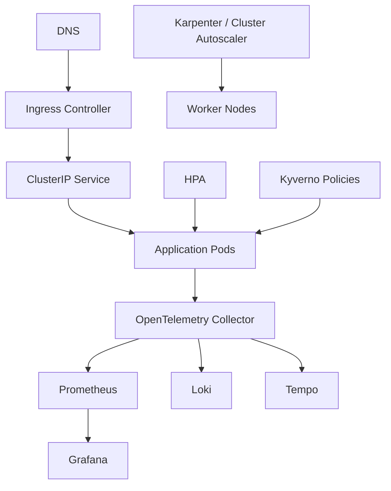

# Platform Architecture

```mermaid
flowchart TB
  DNS[DNS] --> ING[Ingress Controller]
  ING --> SVC[ClusterIP Service]
  SVC --> PODS[Application Pods]
  HPA[HPA] --> PODS
  KARP[Karpenter / Cluster Autoscaler] --> NODES[Worker Nodes]
  PODS --> OTEL[OpenTelemetry Collector]
  OTEL --> PROM[Prometheus]
  OTEL --> LOKI[Loki]
  OTEL --> TEMPO[Tempo]
  PROM --> GRAF[Grafana]
  POLICY[Kyverno Policies] --> PODS
```
