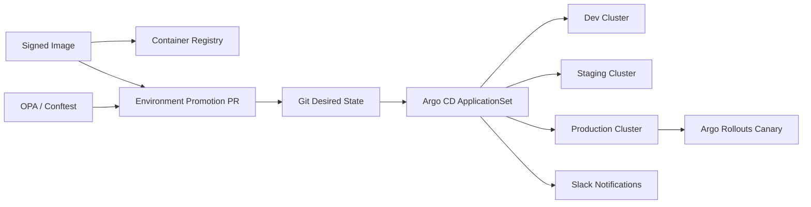

# GitOps Architecture

```mermaid
flowchart LR
  CI[Signed Image] --> REG[Container Registry]
  CI --> PR[Environment Promotion PR]
  PR --> GIT[Git Desired State]
  GIT --> ARGO[Argo CD ApplicationSet]
  ARGO --> DEV[Dev Cluster]
  ARGO --> STG[Staging Cluster]
  ARGO --> PROD[Production Cluster]
  PROD --> ROLLOUT[Argo Rollouts Canary]
  POLICY[OPA / Conftest] --> PR
  ARGO --> NOTIFY[Slack Notifications]
```
